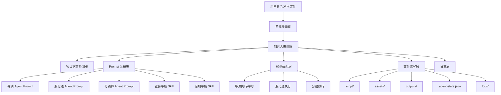

# 系统架构

## 1. 架构目标

系统架构必须服务于两个目标：

1. 忠实复刻当前 Prompt 工程方法
2. 以最小技术复杂度先跑通完整闭环

因此第一版建议采用“文件驱动 + 编排引擎 + 模型适配器”的轻架构，而不是一开始建设重型数据库平台。

## 2. 总体架构图

## 3. 模块划分

### 3.1 命令路由器

职责：

- 解析 `~start`、`~design`、`~prompt`、`~status`、`~help`
- 判断目标集数
- 调用对应编排流程

### 3.2 制片人编排器

职责：

- 按 `CLAUDE.md` 中定义的总控规则调度所有阶段
- 负责阶段前校验、阶段后审核、失败回修、成功推进
- 维护“当前阶段”和“下一步建议”

这是整个系统的核心。

### 3.3 项目状态检测器

职责：

- 扫描 `script/`
- 扫描 `outputs/`
- 判断每集当前阶段
- 恢复 `.agent-state.json`

### 3.4 Prompt 注册表

职责：

- 加载 `CLAUDE.md`
- 加载 `agents/*.md`
- 加载 `skills/**/*.md`
- 加载模板文件

设计原则：

- Prompt 以文件存在，不硬编码到程序
- 运行时按角色和任务拼装上下文

### 3.5 模型适配层

职责：

- 屏蔽不同 API 提供商差异
- 统一处理 `chat/completions` 或 responses 类接口
- 统一超时、重试、Token 上限、温度策略

### 3.6 文件读写层

职责：

- 读取剧本、模板、历史素材
- 写入输出文件
- 执行“覆盖”与“追加”策略

关键规则：

- `01-director-analysis.md` 覆盖写
- `02-seedance-prompts.md` 覆盖写
- `character-prompts.md` / `scene-prompts.md` 追加写

### 3.7 日志层

职责：

- 记录命令、阶段、模型调用、审核结果、回修次数、异常信息

## 4. 运行时阶段架构

### 4.1 阶段一：导演分析

输入：

- `script/<集数>-xxx.md`
- 历史 `assets/*`（可选，用于标注复用/变体）

输出：

- `outputs/<集数>/01-director-analysis.md`

审核：

- `script-analysis-review-skill`
- `compliance-review-skill`

### 4.2 阶段二：服化道设计

输入：

- `outputs/<集数>/01-director-analysis.md`
- `assets/character-prompts.md`（可选）
- `assets/scene-prompts.md`（可选）

输出：

- `assets/character-prompts.md`
- `assets/scene-prompts.md`

审核：

- `art-direction-review-skill`
- `compliance-review-skill`

### 4.3 阶段三：分镜编写

输入：

- `outputs/<集数>/01-director-analysis.md`
- `assets/character-prompts.md`
- `assets/scene-prompts.md`

输出：

- `outputs/<集数>/02-seedance-prompts.md`

审核：

- `seedance-prompt-review-skill`
- `compliance-review-skill`

## 5. 核心设计决策

### 决策 1：文件系统优先

原因：

- 与原项目结构完全一致
- 易审计、易 diff、易人工介入
- 对小团队最稳

### 决策 2：Prompt 即配置

原因：

- 原方法已经被固化在 Markdown 中
- 代码不应该重新表达已有业务知识

### 决策 3：审核与执行分离

原因：

- 审核标准复杂且强依赖阶段上下文
- 分离后更方便调优温度和模型

### 决策 4：同集恢复、跨集重置

原因：

- 保证上下文连续
- 避免多集上下文串味

## 6. 推荐部署形态

第一版推荐命令行或桌面本地服务模式：

- 一个本地进程
- 一个工作目录
- 一套模型配置
- 一组文档输出

不建议第一版就做 Web 多用户系统。
