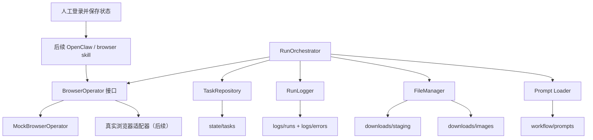

# 系统架构

## 1. 架构目标

一期架构仍然只服务于“登录态复用到图片下载命名”这条主链路，核心目标是简单、稳定、可恢复、可对接。

补充约束：

- 目标执行框架仍为 `OpenClaw`
- 当前机器不部署 OpenClaw
- 因此本次实际落地的是“本地脚本层 + 浏览器接口抽象 + 模拟浏览器实现”

## 2. 当前实际架构图

## 3. 模块说明

### 3.1 RunOrchestrator

- 读取配置、选择器、提示词
- 调度登录态校验、页面定位、提交、等待、下载和命名
- 将任务状态写入 `state/tasks/`
- 产出运行摘要

### 3.2 BrowserOperator

- 作为浏览器操作抽象层
- 负责登录态校验、页面打开、提示词提交、等待生成和下载触发
- 当前已实现 `MockBrowserOperator`
- 后续可替换为 `OpenClaw + browser skill` 的真实适配器

### 3.3 FileManager

- 监听并确认下载文件稳定
- 将原始下载文件复制到归档目录
- 按规则重命名
- 追加写入 JSONL 映射记录

### 3.4 TaskRepository

- 在每次状态迁移后写入任务状态
- 支持失败恢复点固化
- 当前记录粒度覆盖一期全部状态流转

### 3.5 RunLogger

- 写入运行日志 `logs/runs/*.jsonl`
- 写入错误日志 `logs/errors/*.jsonl`
- 对敏感字段做脱敏
- 额外输出运行摘要和诊断文本

## 4. 一期状态定义

- `PENDING`
- `LOGIN_READY`
- `PAGE_READY`
- `PROMPT_SUBMITTED`
- `GENERATING`
- `DOWNLOAD_PENDING`
- `DOWNLOADED`
- `RENAMED`
- `COMPLETED`
- `BLOCKED`
- `FAILED`

## 5. 当前架构结论

当前机器已经完成“一期本地脚本层”的正式实现，并通过模拟浏览器闭环验证；真实浏览器链路仍受部署边界限制，保留到后续可部署机器接入。
