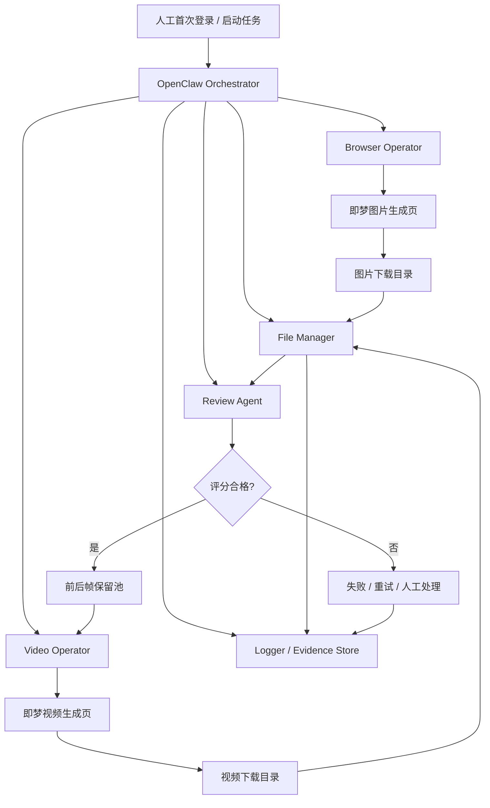

# 系统架构

## 1. 架构目标

架构设计需要同时满足三个目标：

1. 尽量减少对即梦网页 DOM 细节的强耦合
2. 让浏览器动作、本地文件处理、评分决策彼此解耦
3. 为失败重试、人工接管和验收留出明确节点

## 2. 总体架构图

## 3. 模块划分

### 3.1 Orchestrator

职责：

- 读取任务清单和配置
- 调度图片生成、评分、筛选、视频生成各阶段
- 维护任务状态机
- 记录阶段结果与失败信息

### 3.2 Browser Operator

职责：

- 使用 OpenClaw browser skill 操作即梦网页
- 打开指定页面
- 输入提示词、点击生成、监测完成、触发下载
- 处理页面定位与超时重试

### 3.3 File Manager

职责：

- 管理 staging、approved、rejected、videos 等目录
- 执行图片和视频重命名
- 生成元数据文件
- 建立原始文件和规范文件的映射关系

### 3.4 Review Agent

职责：

- 读取图片与对应任务上下文
- 输出结构化评分结果
- 给出是否保留、是否重试的建议

### 3.5 Video Operator

职责：

- 读取通过评分的前后帧
- 操作即梦视频生成页
- 提交 0-5 秒视频任务并下载结果

### 3.6 Logger / Evidence Store

职责：

- 记录执行日志、错误日志、步骤截图
- 落盘评分结果、验收证据和问题日志
- 为回归测试和验收提供支撑

## 4. 状态机设计

建议状态：

- `PENDING`
- `LOGIN_READY`
- `IMAGE_PAGE_READY`
- `IMAGE_GENERATING`
- `IMAGE_DOWNLOADED`
- `IMAGE_RENAMED`
- `REVIEW_PENDING`
- `REVIEW_PASSED`
- `REVIEW_FAILED`
- `FRAME_READY`
- `VIDEO_PAGE_READY`
- `VIDEO_GENERATING`
- `VIDEO_DOWNLOADED`
- `COMPLETED`
- `BLOCKED`
- `FAILED`

## 5. 关键设计决策

### 决策 1：登录态与执行态分离

首次登录由人工完成，自动化流程只消费已存在的登录态。这样能减少账号安全风险，也更符合网页端风控现实。

### 决策 2：浏览器动作与本地后处理分离

浏览器只负责“在网页中完成任务”，不把命名、筛选、归档逻辑硬塞进网页脚本里，便于调试和回放。

### 决策 3：评分与生成分离

评分角色不直接操作浏览器，避免“既出图又打分”的自我偏差。评分结果必须结构化，供后续规则判断。

### 决策 4：视频阶段只消费已通过的帧

视频生成依赖合格前后帧，任何一帧不合格都阻塞视频阶段，确保质量门槛前置。
